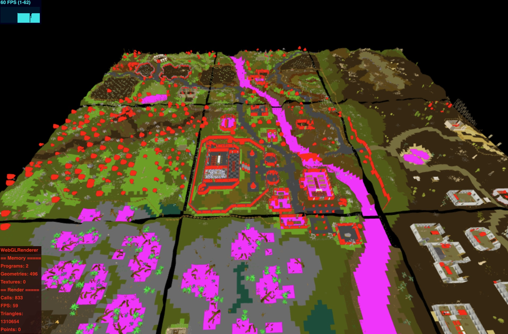

# Runescape Map Viewer
A web based map viewer for runescape 377.
 

[LIVE LINK](https://aifanatic.github.io/runescape-map-viewer/dist/index.html)
 
*Downloads the cache from the repo, check the network tab*
 
*Initially you need to pan the camera to see the map*

### Notes
The code is not particularly clean.
 
Uses some simple tricks in order to increase performance.
 
Some things are not done like floor and object textures, floor vertex color blending, animations etc.